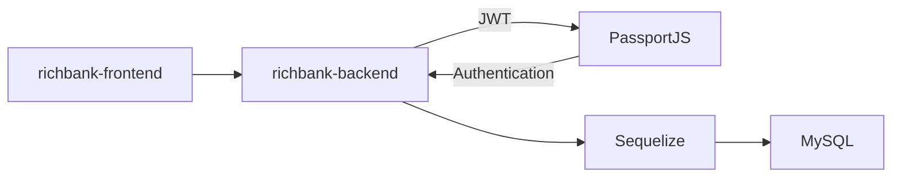
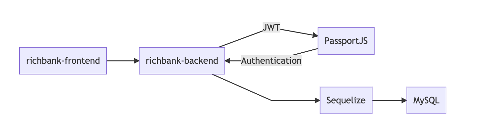

# Rich Bank

## 📘 Description

Rich Bank คือ ระบบ Internet Banking ที่สามารถตรวจสอบข้อมูลบัญชีของผู้ใช้ สามารถแสดงรายการธุรกรรมของผู้ใช้ และสามารถโอนเงินไปยังบัญชีอื่นได้

## 📦 Built With

### Frontend

- [x] React
- [x] Ant Design

### Backend

- [x] NodeJS
- [x] Express
- [x] PassportJS
- [x] MySQL2

## 🛠 Structure

## 📋 Features

- ตรวจสอบข้อมูลบัญชีของผู้ใช้
- แสดงรายการธุรกรรมของผู้ใช้
- โอนเงินไปยังบัญชีอื่น

## ⚙️ Configurations

### Frontend

### Backend
