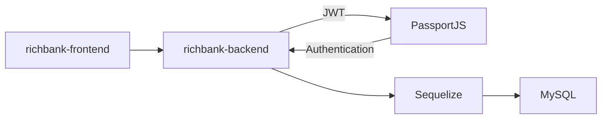

# Rich Bank

## 📘 Description

Rich Bank คือ ระบบ Internet Banking ที่สามารถตรวจสอบข้อมูลบัญชีของผู้ใช้ สามารถแสดงรายการธุรกรรมของผู้ใช้ และสามารถโอนเงินไปยังบัญชีอื่นได้

## 📦 Built With

### Frontend

- [x] React
- [x] Ant Design

### Backend

- [x] NodeJS
- [x] Express
- [x] PassportJS
- [x] MySQL2

## 🛠 Structure




## 📋 Features

- ตรวจสอบข้อมูลบัญชีของผู้ใช้
- แสดงรายการธุรกรรมของผู้ใช้
- โอนเงินไปยังบัญชีอื่น

## 💡 Getting Started

Clone Project

```bash
git clone https://github.com/beenanthiya/Personal-Project
```

### Frontend

```bash
cd richbank-frontend
npm install
npm start
```

### Backend

```bash
cd richbank-backend
npm install
node index.js
```

Before `node index.js` edit your password and database name in config/config.json

## ⚙️ Configurations

Edit your password and database name in config/config.json

```bash
{
  "development": {
    "username": "root",
    "password": "your-password",
    "database": "your-db",
    "host": "127.0.0.1",
    "dialect": "mysql"
  },
  "test": {
    "username": "root",
    "password": "your-password",
    "database": "your-db",
    "host": "127.0.0.1",
    "dialect": "mysql"
  },
  "production": {
    "username": "root",
    "password": "your-password",
    "database": "your-db",
    "host": "127.0.0.1",
    "dialect": "mysql"
  }
}
```
