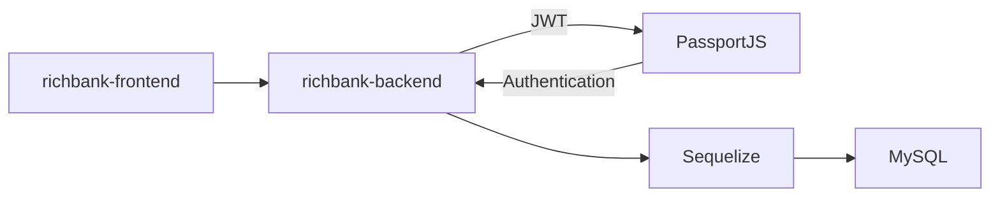

# Rich Bank

## 📘 Description

Rich Bank คือ ระบบ Internet Banking ที่สามารถตรวจสอบข้อมูลบัญชีของผู้ใช้ สามารถแสดงรายการธุรกรรมของผู้ใช้ และสามารถโอนเงินไปยังบัญชีอื่นได้

## 📦 Built With

- [x] React
- [x] Ant Design

## 🛠 Structure




## 📋 Features

- ตรวจสอบข้อมูลบัญชีของผู้ใช้
- แสดงรายการธุรกรรมของผู้ใช้
- โอนเงินไปยังบัญชีอื่น

## 💡 Getting Started

1. Clone Project

```bash
git clone https://github.com/beenanthiya/Personal-Project
```

2. Start Project

```bash
cd richbank-frontend
npm install
npm start
```
